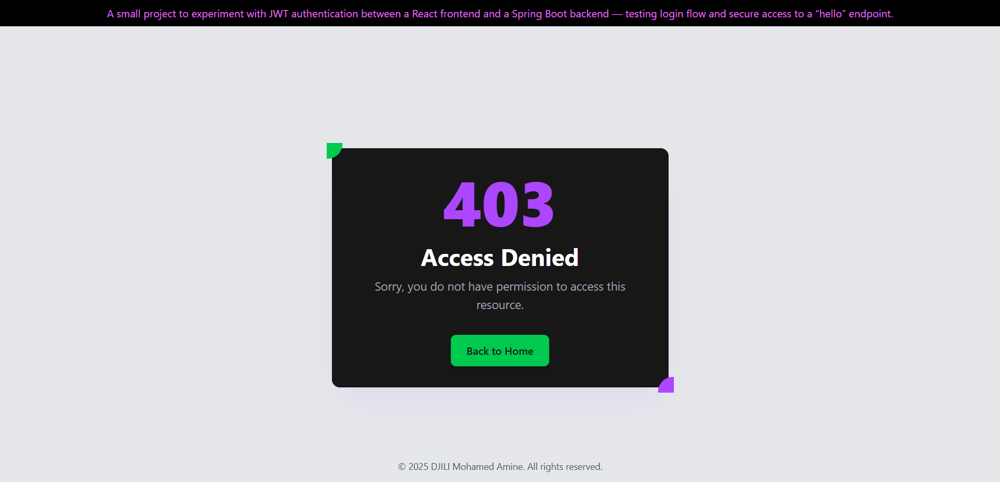
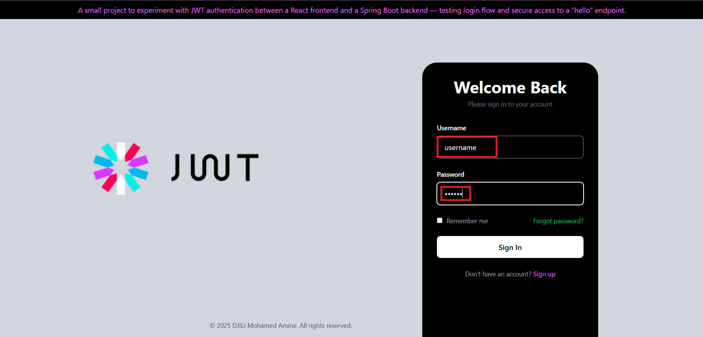
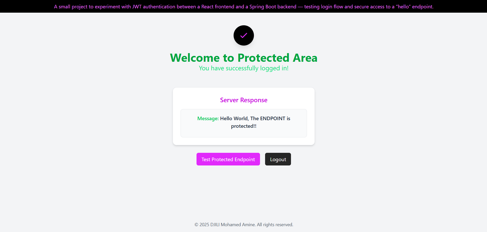

<p align="center">
  
</p>

<h1 align="center">JWT Demo</h1>

<h4 align="center">Demo of JWT authentication with Spring Boot backend and React frontend, featuring login and protected routes.</h4>

<p align="center">
   
   
   
   
</p>

# JWT Authentication Demo (or: How I Learned to Stop Worrying and Love the Token)

Look, we've all been there. You're building an app, everything's great, and then someone asks "but how do we know who's who?" and suddenly you're knee-deep in authentication rabbit holes. This repo is my therapy session turned into code.

This is a full-stack JWT authentication playground featuring Spring Boot doing the heavy lifting on the backend and React frantically managing tokens on the frontend. It's got login, logout, protected routes, and that sweet, sweet "you shall not pass" redirect when someone tries to sneak in.

## What's Actually Going On Here?

**The Main Idea:** Imagine a bouncer at a club who gives you a wristband when you pay at the door. That wristband lets you get drinks, use the bathroom, whatever. You don't need to show your ID every single time – just flash the wristband. JWT is basically that wristband, except it's made of JSON and cryptographic signatures instead of paper and sadness.

When you log in, the server checks your credentials and hands you a token (the wristband). From that point on, you show that token to access protected stuff. No sessions, no cookies following you around like a puppy, just stateless authentication goodness.

## The Cast of Characters

### Backend (Spring Boot) - The Bouncer

* **Language:** Java (because apparently we still enjoy typing `public static void`)
* **What it does:**
   * `/api/auth/login` - Where you prove you're you and get your magic token
   * `/hello` - The VIP lounge that checks your wristband at the door
   * JWT Authentication Filter - The actual bouncer checking wristbands
   * SecurityConfig - The club's rule book (CORS, BCrypt, who gets in, who gets kicked out)

### Frontend (React + Vite) - The Party-Goers

* **The Pages:**
   * **LoginPage** - Where you convince the bouncer you're on the list. Stores your token in `localStorage` (yeah, we'll talk about that later)
   * **HelloPage** - The VIP section. Flashes your token to fetch exclusive content
   * **ProtectedRoute** - The velvet rope that checks if your token is legit before letting you through
   * **NotAuthorized** - The "nice try, buddy" page when you show up with a fake wristband
   * **Logout** - Rips up your wristband and escorts you back to the entrance

### API Service - The Messenger Pigeon

Centralized Axios setup because nobody wants to write `fetch` a million times:
* `login(username, password)` → "Hey, am I cool enough to get in?"
* `getHello(token)` → "I have a wristband, can I see the secret handshake?"

## The Authentication Dance 

1. User shows up at `LoginPage` with username and password
2. Backend checks the credentials (probably against a database, or in this demo, probably just hardcoded because it's a demo and we're not monsters)
3. If legit, backend generates a JWT token and tosses it back
4. Frontend catches it and stuffs it in `localStorage` like a chipmunk hoarding nuts
5. User tries to access `HelloPage`
6. `ProtectedRoute` is like "hold up, let me see that token"
7. Backend validates the token:
   * Valid? Come on in, the water's fine
   * Invalid/expired/missing? Straight to `NotAuthorized`, do not pass Go
8. User can logout anytime, which yeeets the token into the void and sends them back to square one

Want to know how JWT *actually* works under the hood? Check out my other brain dump: [JWT From Scratch](https://github.com/SieGer05/jwt-from-scratch)

## Screenshots (Proof This Actually Works)

### 1. "Who Are You Again?" - Unauthorized Access
What happens when you try to waltz into `/hello` without a token. Spoiler: you get rejected faster than my Tinder matches.



### 2. "You're In" - Successful Login
The login page in all its glory. Type the magic words, get the golden ticket.



### 3. "Welcome to the Party" - Valid Access
`HelloPage` actually working, with the backend saying hello back. It's beautiful when frontend and backend get along.



## How to Run This Thing

### Backend Setup
```bash
# Clone this bad boy
git clone https://github.com/SieGer05/jwt-auth-fullstack.git>

# Open in your favorite IDE (or IntelliJ, we don't judge... much)
# Make sure you've got Java 21 installed
# Hit that run button on your Spring Boot app
# Backend should be vibing at http://localhost:8080
```

**Important:** Make sure CORS is set up to allow `http://localhost:5173` or React will throw a tantrum.

### Frontend Setup
```bash
# Navigate to the frontend folder
cd frontend

# Install dependencies (grab a coffee, this might take a minute)
npm install

# Fire it up
npm run dev

# Open http://localhost:5173 in your browser
# Try logging in and poking around
```

## What You'll Learn (Whether You Like It Or Not)

* How JWT authentication actually works in a real full-stack app
* Why everyone keeps saying "stateless" like it's the solution to all problems
* How to protect routes on the frontend without crying
* Handling unauthorized access like a civilized human being
* Why storing JWTs in `localStorage` is convenient but might make security people twitchy
* CORS configuration (the thing that always breaks on day one)
* That beautiful moment when frontend and backend actually talk to each other

## Why This Exists

I made this because every JWT tutorial I found was either:
- Too simple ("here's how to generate a token bye")
- Too complex ("now let's implement OAuth2 with SAML and a partridge in a pear tree")
- Missing the full-stack picture

This is the Goldilocks version. It's got just enough to understand the flow without drowning in enterprise architecture.

Perfect for: students, bootcamp grads, that one friend who keeps asking "but how does login work?", or anyone who wants to understand JWT without reading 47 Medium articles.

---

**Note:** This is a learning project. Before deploying anything to production, please for the love of all that is holy, read about proper token storage, refresh tokens, and why your security team might have opinions about `localStorage`.

Now go forth and authenticate responsibly!